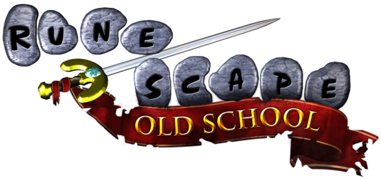
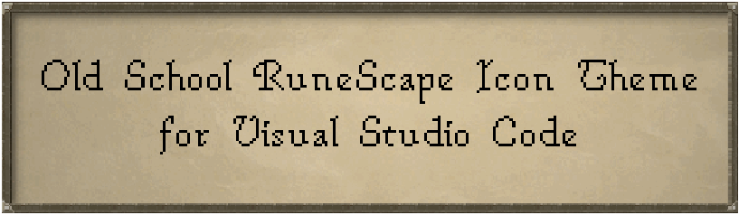
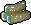
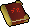
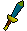
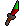
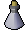
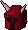

  

  

  &nbsp;
  &nbsp;
  

(Old School) RuneScape themed file icon pack for VSCode!  The theme supports a dozen language and various toolset files/extensions:

**Web development:** .html , .css  (and its variants) .js , .ts , .php , .rb 

**Python:** .py , .pyc , .ipynb 

**C/C++:** .c , .cpp , .h , .hpp , CMakeLists.txt 

*And more, including:* **Java**, **C#**, **Dart**, **Elixir**, **Rust**, **Lua**, **bash**, **SQL**, **R**

# Request an Icon ✨ 

[Open up an icon request/suggestion!](https://github.com/392781/vscode-runescape-icon-theme/issues/new/choose) ***Icons are subject to change!*** 🏗🚧

# Resources 📖

Icons from [OSRS Wiki](https://oldschool.runescape.wiki/).

Used [angelenelm's Animal Crossing VSCode Icon Theme](https://github.com/angelenelm/Animal-Crossing-VSCode-Icon-Theme) as an initial template.

Development information found [here](./DEVELOPMENT.md).

Created using intellectual property belonging to Jagex Limited under the terms of Jagex's Fan Content Policy. This content is not endorsed by or affiliated with Jagex.
