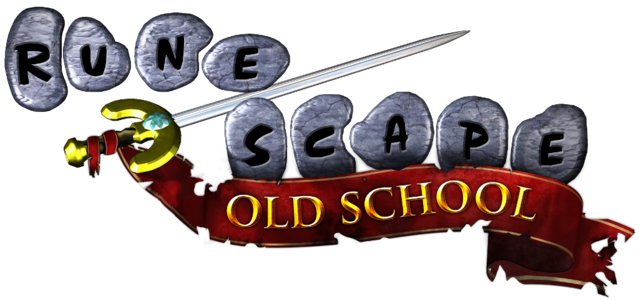

  

# RuneScape Icon Theme for Visual Studio Code

(Old School) RuneScape themed file icon pack for VSCode! Currently a work in progress... 🏗🚧

# Icons

| icon                                                 | file      |
| ---------------------------------------------------- | --------- |
|                                                      |           |
|            | `default` |
|               | `html`    |
|                 | `css`     |
|  | `js`      |
|    | `json`    |
|  | `md, txt` |
|           | `py`      |
|               | `images`  |
|                 | `logs`    |
|             | `git`     |
|             | `ignore`  |
|          | `lock`    |
|   | `env`     |
|  | `tf`      |
|           | `yml`     |

# Resources

Icons from [OSRS Wiki](https://oldschool.runescape.wiki/).

Forked from [angelenelm's Animal Crossing VSCode Icon Theme](https://github.com/angelenelm/Animal-Crossing-VSCode-Icon-Theme)!

Created using intellectual property belonging to Jagex Limited under the terms of Jagex's Fan Content Policy. This content is not endorsed by or affiliated with Jagex.
